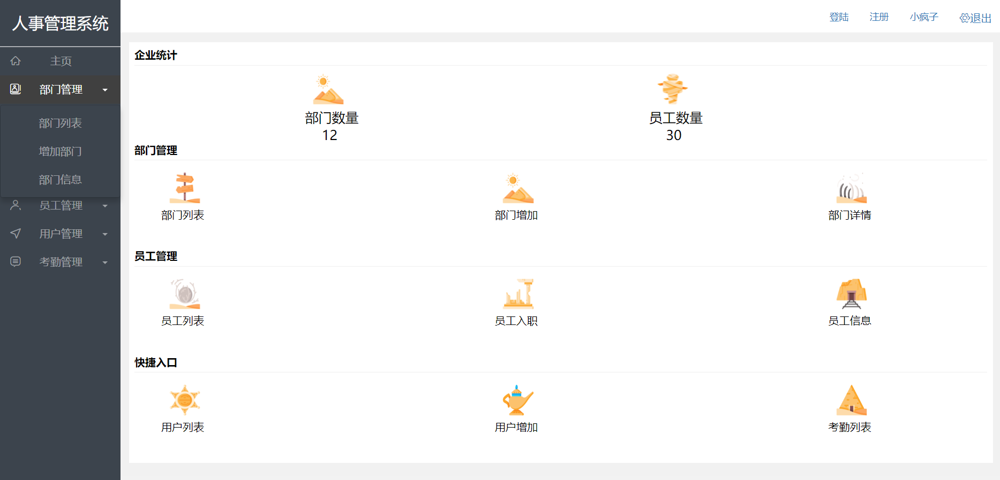
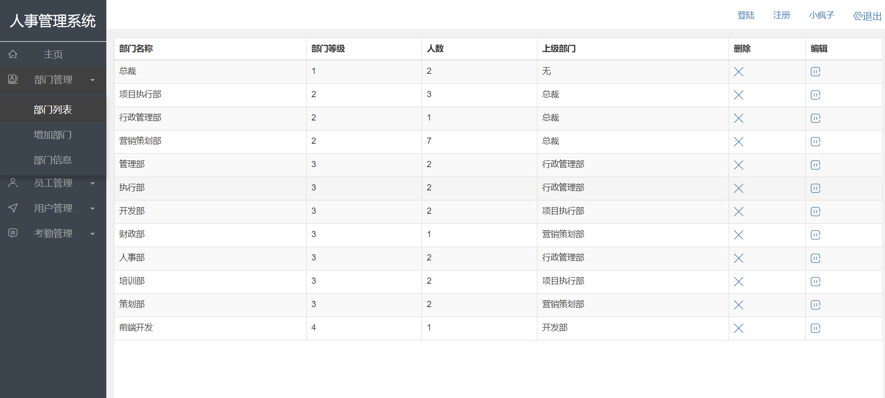
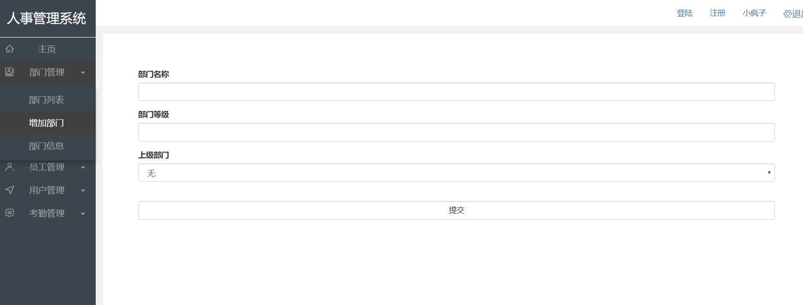
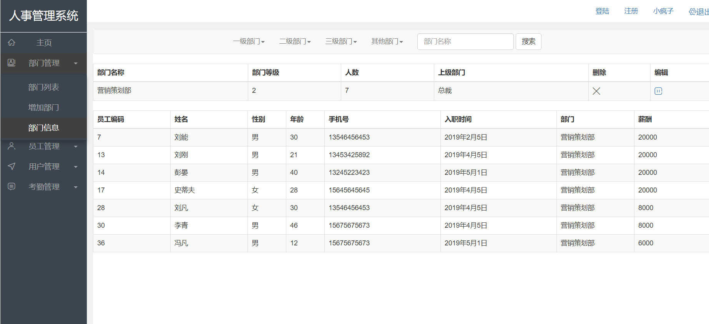
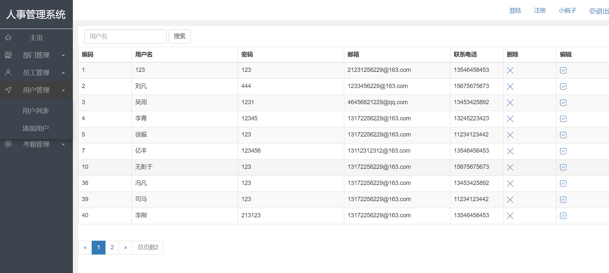
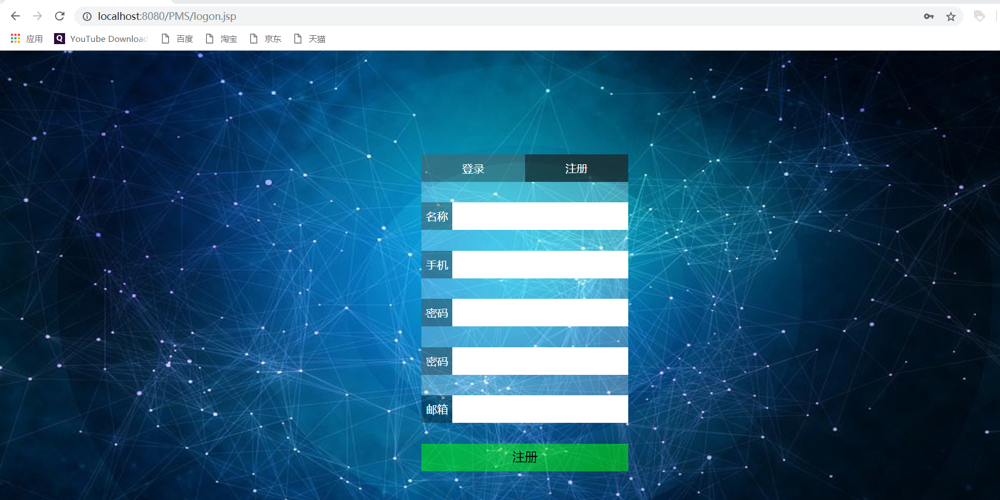
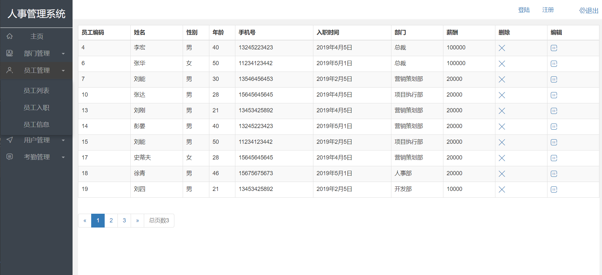
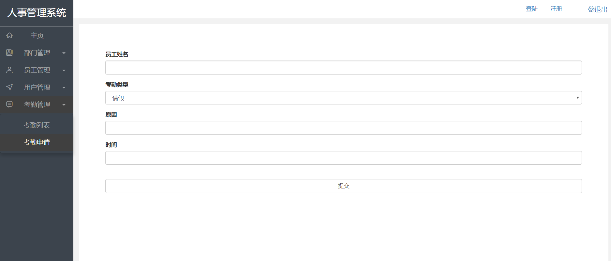
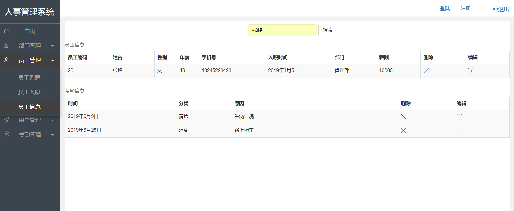

# 人事管理系统

## 1. 系统简介

系统是人事管理系统，是基于公司的人事管理而设计的动态web系统,是对该公司的人事资料进行简单管理,为人事管理人员提供了一套操作简单、使用可靠、界面友好、易于管理和使用的处理工具。主要有四大功能模块：部门管理、员工管理、用户管理以及考勤管理。本系统对人事各种数据进行统一处理,避免数据存取、数据处理的重复,提高工作效率,减少了系统数据处理的复杂性。本系统不仅使该公司人事管理人员从繁重的工作中解脱出来,而且提高了人事管理的效率,提高了人事管理的科学性,方便了用户査询、管理人进行管理。

## 2.开发平台+运行环境

* 开发平台
  * Eclipse  MySQL。

* 运行环境
  * 操作系统：Windows 98/2000/XP/2003
  * 数 据 库：MySQL
  * 支持环境：Tomcat+JDK+Eclipse

## 3.功能描述

### 3.1 功能的划分

本人事管理系统主要由四大方面的功能组成：

* 部门管理。部门列表，查找部门，增删部门，修改部门，部门员工信息。

* 用户管理。用户列表，查找用户，增删用户，修改用户。
* 员工管理  员工列表，查找员工，增删员工，修改员工，查看员工考勤信息
* 考勤管理 考勤列表，查找考勤情况，增删考勤信息，修改考勤信息

### 3.2 功能说明

#### 3.2.1部门管理。

* 部门列表：显示系统中所有部门的信息，包括部门名称，等级，人数，上级部门，可点击删除或编辑按钮，改变某一条部门信息
* 删除部门：通过获取部门的编码，删除该部门，删除成功，返回部门列表页面
* 编辑部门：通过获取部门的编码，传送数据显示到部门修改页面，进而修改部门信息
* 增加部门：通过输入部门名称、等级、选择上级部门，新增一个部门
* 部门信息：通过选择或搜索某个部门名称，显示该部门的所有信息和属于该部门的员工信息表，包括员工编码、姓名、性别、年龄、手机号、入职时间、部门

 

#### 3.2.2  用户管理。

* 用户列表：显示使用该系统中用户的信息，包括用户编码，用户名，密码，邮箱，联系电话，可点击删除或编辑按钮，改变某一条用户信息，每次显示10条数据，可通过点击页码选择查看的页数，
* 查找用户：通过输入用户名称，查找某个用户的信息，可进行删除或编辑操作
* 删除用户：通过获取用户的编码，删除该用户，删除成功，返回上次访问的用户列表页
* 编辑用户：通过获取用户的编码，传送数据显示到用户修改页面，进而修改用户信息
* 增加用户：通过输入用户名、密码、手机号、邮箱，新增一个用户

#### 3.2.3员工管理  

* 员工列表: 显示使用该系统中员工的信息，包括员工编码，工资，联系电话，部门，性别等等可点击删除或编辑按钮，改变某一条用户信息，每次显示10条数据，可通过点击页码选择查看的页数，
* 查找员工:通过姓名在数据库中查找员工的所有数据，并在列表中依次展示
* 增删员工，修改员工: 通过输入员工名称，查找某个员工的信息，可进行删除或编辑操作
* 查看员工考勤信息: 通过姓名找到员工编号，利用外码搜索出考勤表中对应的考勤记录

#### 3.2.4考勤管理  

* 考勤列表: 显示使用该系统中考勤情况的信息，包括时间，类型，原因，可点击删除或编辑按钮，改变某一条用户信息，每次显示10条数据，可通过点击页码选择查看的页数，
* 查找员工考勤情况:通过姓名在数据库中查找员工考勤情况的所有数据，并在列表中依次展示
* 增删考勤记录：修改考勤记录: 通过输入员工名称，查找某个员工考勤的信息，可进行删除或编辑操作
* 修改考勤记录：通过按的传值，将修改考勤的初始数据放在一个页面，可供用户观察和选择修改的内容

 

## 4. 性能描述

A.      数据精确度。本系统的数据类型主要包括：整型、字符型、日期类型、电子邮件类型。数据的录入一定要严格按照数据的格式，否则系统不予响应处理，并显示出错的信息。

B.       数据的完整性。凡是需要录入信息的表单（如采购单、销售单、添加用户等），一定要求把所有数据都填写上，以免出现不满足数据的完整性。

C.       时间特性。对于系统所有提交、删除、编辑等操作，以及向数据库查询、更新、插入等操作，可以在1~2秒响应其相关的操作，打印操作的速度相对而方言府慢点，但也能满足用户的需求。

D.      适应性。本系统能适应多种操作系统，存储的记录也可以满足公司企业的需求，系统的全部库存量是1000，如果将近库存量系统将会显示相应的信息。

## 5. 安全需求

本系统中每个用户都有自己的编号，自己的密码，用户无法看到另一个用户的密码，系统本实现注册用户后需要邮箱验证，这样就可以保证数据的安全性，以免数据被恶意的修改和破坏。在后台数据处理上使用了5个模块分别处理，各数据之间工作分明，不会破坏数据库。

 

## 6. 接口

**6.2.1** **外部接口**

以网页的形式使用IE浏览使用程序，在出错显示上使用JavaScript对话框提示及FleaPHP框架自带的错误提示系统。

**6.2.2** **内部接-口**

内部接口方面，各模块之间采用控制器调用、函数调用、参数传递、返回值的方式进行信息传递。

**6.2.3** **软件接口** 

程序使用PHP提供的对MySQL的接口，进行对数据库的所有访问，数据库备份采用读出并保存到文件的方法，把数据库信息保存到磁盘文件上。

**6.2.4** **硬件接口**

在输入方面，对于键盘、鼠标的输入，使用表单、链接等进行传递。

 

## 7. 系统存在的问题

功能过于简单，界面过于单调，不适合，版本语言语言，暂时不支持其他语言，只有中文版本，不支持微信和qq登陆。

 

## 8. 收获及心得体会

在本次的课程设计中，我们两个同学组成了系统开发团队，分别进行系统资料收集、需求分析、详细设计、系统测试与运行，基本上能运用软件工程的开发思路进行数据库系统的设计，并且实现了数据库系统的各项功能，虽然系统的规模不大，功能的实现也比较简单，系统的管理维护方面还不够完善，但经过了本次的设计，对我们团队的每个同学能力培养都有很大帮助，无论是编程语言还是数据库设计都得到了不同程度上的提高，同时加强了我们同学之间的学习交流能力，培养了较好的团队开发能力。最重要的是我们设计过程中，把课堂上和课外中学习到的理论知识融合到设计全过程中，真正地做到了理论结合实践，在一定程度上使我们对理论知识更进一步的理解，真的受益匪浅。

 